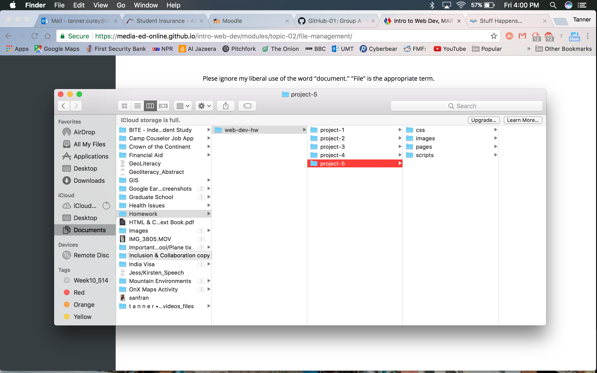

# **My First README.md**

## **Tanner Curey**

**Hi!**

This is my first time doing any real coding. While I have been confused during this process, I've learned that with commitment and perseverance I am able to complete the task at hand.

---

_What I've Learned_

1. I've learned basic markdown commands.
2. I learned how to organize files.
3. I also begain to gain an understanding of html.

_My Goals_

* To independently write my own code and make it live on my own site.
* To learn markdown well enough to not rely on the cheat sheat.

`Inline Code`
`This is a foreign language`

[Link to the markdown cheat sheat](https://github.com/adam-p/markdown-here/wiki/Markdown-Cheatsheet#links)

This process requires a lot of trial and error and patience but i'm surviving. I struggled with general concept of connecting the github desktop to atom initally but I eventually realized that they had already been connected. At times I also struggles with markdown by making some minor character errors that throw off the intended design. I found HTML and the live site to be much easier than this readme portion of the assignment. Perhaps it's because of the practice in part 1 that better prepared me for part2, maybe it is getting a little easier afterall?
