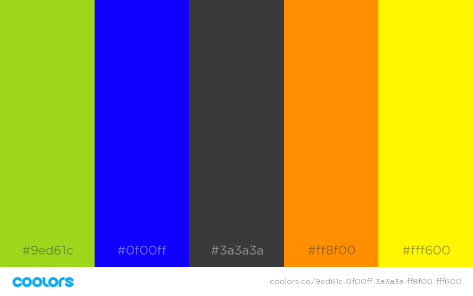

# **Project 3:**
## _By Tanner Curey_

**Color Palette:**
I am very partial to clean looking web design and going for a sleek yet simple look. It's definitely easier to have an eye for this balance of sleek and simple than it is to actually create it. I chose to focus my project on Soccer, particularly the English Premier League and the MLS. Being that my topic focuses on soccer teams I decided to incorporate the teams that I wrote about into my color palette to represent their team colors. However, my goal was to not let these colors (that don't go together great when you have 4 different color schemes) overwhelm the main design of my pages. For my key colors I chose to have a main background color of _black_ with text in _white_ and text bubbles in _white_ with the text in _black_. At the top of every page I chose to use _red_ as the header.

**Main Colors**

**Colors Used for Soccer Teams**

**Typography**
I tried to not use too many fonts and maintain a healthy balance of fonts that would flow well together. I'm generally partial to the sans-serif fonts so naturally only the quotes that I included were in a serif font. I started out simple with fonts like helvetica to achieve a clean look but then wanted a more modern and look to my text so I began to branch out. The main two fonts that I used were _Orbitron_ and _Roboto_. I felt that Orbitron provided a nice, clean, modern look for my titles, headers, and team names. I really like the look of Roboto as the main text and thought it complimented Orbitron well. I look forward to being able to experiment more with typography and how color, size, fonts, etc. develop characters as attractive images.

**CSS Struggles and Accomplishments:**
I enjoyed building this project and liked messing around with colors and fonts. I definitely struggled for awhile with linking my css style sheet and organizing everything in an appropriate manner. I like the way my pages turned out and now feel much more confident in creating even more complex sites in the future.

**Final Touches**
After revisting my CSS project for **HW-06** I realized many more ways use CSS intead of HTML. At the beginning of this project I still wanted to utlized a lot of HTML because I felt comfortable with it and new how to easily do a task that seemed more challenging in CSS. Now that i've spent sometime with CSS I see how it can simplify the coding process and lead to better organization, functioning, and style. Next time I use CSS I think my code should be a lot cleaner, I felt that I had so much going on in this project where I didn't quite know when to use CSS but now I have a much better understanding. My final touches included:

* Adding Header Logos
* Adding a Dropdown
* Adding more padding
* Adding a Navbar
