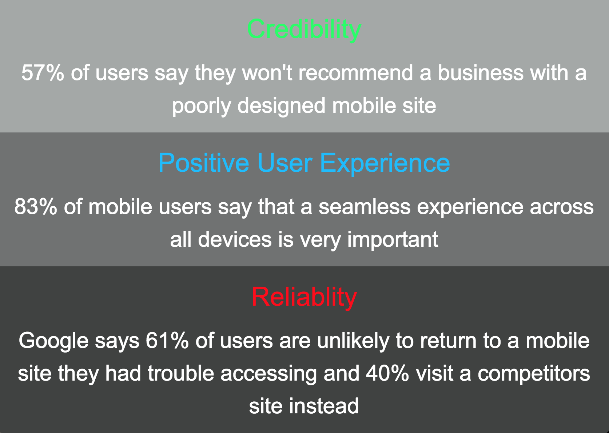
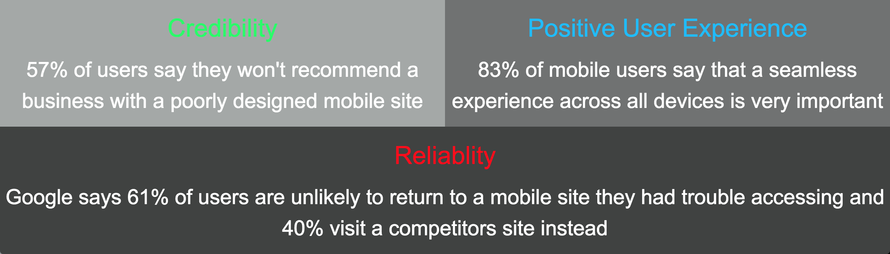

# **Project 4:**
## _By Tanner Curey_

I wanted to make simple and clean site that demonstrated why RWD is important. To do this I wanted to incorporate a lot of facts about why RWD is so important. I had the idea of making the site look like a real website but with the style of a infographic. I explored various displays at different screen sizes. Fixing my main image to adapt to various scree displays was challenging at first but after playing around with the code for awhile I was able to get it to adapt appropriately. I had to play around with the Navbar as well to make it fully responsive. While this project wasn't necessarily easy, it was achievable and made me think "why wouldn't you make your site responsive?"

**RWD Goals:**
* Maintaing a clean look with an attractive color scheme
* Optimize the site for all screen sizes in an attractive manner
* Create a NavBar that is responsive
* Add an image that is Responsive
* Provide facts, examples, and stats of why RWD is important

**Images of RWD on my page (Image is only one portion of my site)**

**How my site looks on a Tablet size display (looks the same on phone just more condensed)**

**How my site looks on a Computer size display**

